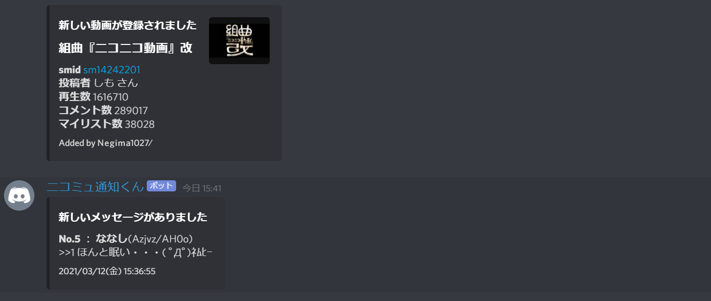

DiscordBot "ニコミュ通知くん"
===
このプログラムはニコニココミュニティー上の掲示板や登録動画の更新を確認しDiscordに通知するBotです。
Herokuを使用しており、利用にはニコニコ動画の会員登録、DiscordBotの利用登録が必要です。

## Demo


## Requirement
```
python-3.8.8
discord.py
requests
beautifulsoup4
psycopg2
```

## Usage
1. Create a DiscordBot and get an access token. (https://discord.com/developers/applications)
2. Deploy this application to Heroku. (https://dashboard.heroku.com/apps)
3. Create a database on Heroku using postgres. Refer to `script/table.sql` for SQL of creating a table.
4. Set the access token for Discord and the email address and password for Nico Nico Douga in the Heroku environment variables.
   ```
   ACCESS_TOKEN = *************************************
   NICO_EMAIL = xxx@xxx.com
   NICO_PASSWD = ***********
   DATEBASE_URL = postgres://************************
   ```
5. Turn on discordbot's Dyno on Heroku.

## Commends
```
-nn setup
質問形式でこのBotのセットアップをします。
-nn remove
このサーバーに登録された情報を一度削除します。
-nn status
サーバーに登録されている情報を表示します。
-nn help (ja/en)
ヘルプメッセージを表示します。
-nn author
制作者情報を表示します。
```

## Licence
Under the [MIT Licence](LICENCE.md)

## Author
[Negima1072](https://twitter.com/Negima1072)

Copyright (c) 2021 Negima1072.